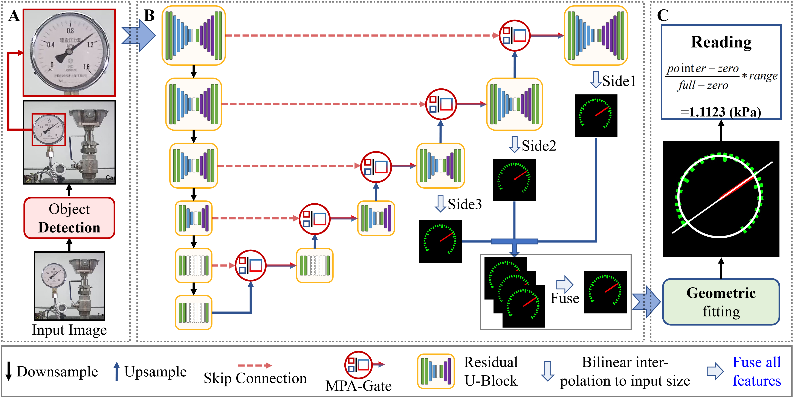

# MPANet

## An Effective Semantic Segmentation Network with Multi-Path Attention for Industrial Meter Pointer Images

Dayu Tan  ([click if have problem](mailto:tandayu19@163.com)), **Jinlong Wang**, Yansen Su (Corresponding Author), Zhijun Zhang, Xin Peng, Chunhou Zheng, and Weimin Zhong

Meter pointers exhibit stable and anti-interference capabilities, rendering them extensively utilized in industrial environments. However, automated reading poses a significant challenge due to the fact that current segmentation methods struggle to isolate the fine-grained pointers and scales for accurate reading calculations. This challenge can be alleviated by enhancing the feature extraction capability of the segmentation network. As is well-known that Attention plays an essential role in human vision by selectively focusing on convex parts, and attention-based methods have been applied to various computer vision tasks. Therefore, we propose a new image segmentation network called Multi-Path Attention Network
(MPANet) for pointer meter recognition in the complex industrial environments. The designed network employs an attention gate mechanism to proficiently capture local features stemming from various pathways during skip-connection and upsample processes. Additionally, our network incorporates deep supervision by merging the outputs of the final three layers to extract abundant low-dimensional information. To further improve the performance of encoders and decoders, a residual U-block is employed, thereby forming an enhanced U-shaped network structure.  In the experiments, we employ HD95, Dice, and Recall as evaluation metrics. MPANet demonstrates superior performance compared to state-of-the-art networks on three our self-collected datasets, showing improvements of over 1% across all metrics. In addition, we validate the efficacy of MPA as a plug-and-play module and the benefits of applying deep supervision to multi-decoder network.

The proposed network represents a significant advancement in the field of industrial environment image segmentation and provides a highly accurate and efficient method for reading pointer meters. MPANet can potentially improve the efficiency and safety of industrial processes, and we believe it will become an important tool for engineers and technicians in various industries. The main contributions of this paper can be summarized as follows:

- We design a novel multi-path mechanism, seamlessly integrates global and local features from various pathways with channel attention and parallel spatial attention, forming MPA. The mechanism adaptable attention acts as a plug-and-play component, effectively enhancing CNN network performance.

- We propose an efficient supervised strategy, optimizing results by fusing the outputs of the first three decoders. The strategy integration unlocks the potential of rich, low-dimensional features, significantly enhancing multi-decoder network performance.

- This study presents MPANet, a novel segmentation network that addresses shortcomings in existing models' context understanding and feature extraction. It can integrate detection and calculating algorithms to implement meter recognition, achieving exceptional performance, as showcased in our experiments.

